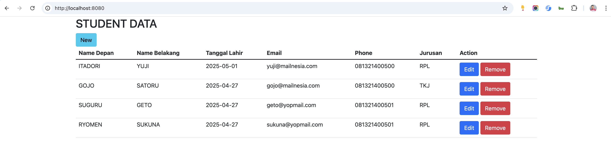

# Spring Boot Wilayah Indonesia

A Spring Boot application for managing Indonesian administrative regions (Provinsi, Kota/Kabupaten, Kecamatan, Kelurahan) with interactive map visualization using PostGIS and Leaflet.js.

## Features

### 📊 Administrative Data Management
- Complete Indonesian administrative hierarchy (4 levels)
- Student registration with location selection
- RESTful API for all administrative levels
- Cascading dropdown filters

### 🗺️ Interactive Map Visualization
- **Real-time boundary visualization** using Leaflet.js and OpenStreetMap
- **PostGIS integration** for geospatial data storage
- **GADM boundary data** (Global Administrative Areas)
  - 32 Provinces with geometry (94.1% coverage)
  - 458 Cities/Regencies (89.1% coverage)
  - 5,801 Districts (80.2% coverage)
  - 59,671 Villages (71.5% coverage)

### 🔍 Smart Search Features
- **Autocomplete province search** with dropdown
- **Keyboard navigation** (↑↓ arrows, Enter, Esc)
- **Clear button** for quick reset
- **Real-time filtering** as you type
- **Click-to-select** from dropdown
- **Auto-load boundary** - province boundary automatically displays on map when selected

### 🎯 Map Controls
- **Multi-level boundary display** (Provinsi → Kota → Kecamatan → Kelurahan)
- **Cascading filters** for precise area selection
- **Auto-load on selection** - province boundaries automatically load and display when selected
- **Zoom to selection** - automatically zoom to selected boundaries
- **Clean polygon rendering** - displays only boundary polygons without markers or dots
- **Interactive popups** with boundary information
- **Hover effects** for boundary highlighting
- **Reset view** to Indonesia center

## Technology Stack

- **Backend**: Spring Boot 4.0.1
- **Database**: PostgreSQL 18 with PostGIS 3.4
- **ORM**: Spring Data JPA with Hibernate Spatial
- **Frontend**: Thymeleaf, Bootstrap 4, Leaflet.js 1.9.4
- **Geospatial**: JTS Topology Suite, PostGIS
- **Migration**: Flyway
- **Build Tool**: Maven

## Prerequisites

- Java 21+
- Maven 3.6+
- Docker & Docker Compose
- GDAL/OGR tools (for GADM data import)

## Quick Start

### 1. Clone the Repository
```bash
git clone https://github.com/hendisantika/spring-boot-wilayah-indonesia.git
cd spring-boot-wilayah-indonesia
```

### 2. Start PostgreSQL with PostGIS
```bash
docker-compose up -d db
```

### 3. Configure Database
Database credentials are in `application.properties`:
```properties
spring.datasource.url=jdbc:postgresql://localhost:5434/wilayah_indonesia
spring.datasource.username=yu71
spring.datasource.password=53cret
```

### 4. Run the Application
```bash
mvn clean spring-boot:run
```

### 5. Access the Application
- **Main Application**: http://localhost:8080
- **Interactive Map**: http://localhost:8080/map

## GADM Data Import (Optional)

To enable map visualization with real boundary data:

### 1. Download GADM Data
Download Indonesian boundary data from [GADM](https://gadm.org/download_country.html):
- Format: GeoJSON
- File: `gadm41_IDN_4.json` (Level 4 - Villages)
- Place in: `src/main/resources/`

### 2. Install GDAL Tools
```bash
# macOS
brew install gdal

# Ubuntu/Debian
apt-get install gdal-bin
```

### 3. Run Import Scripts
```bash
# Import level 4 (villages) data
chmod +x scripts/import-gadm-level4.sh
./scripts/import-gadm-level4.sh

# Create parent geometries (provinces, cities, districts)
chmod +x scripts/create-parent-geometries.sh
./scripts/create-parent-geometries.sh

# Match geometries to database records
chmod +x scripts/match-gadm-to-database.sh
./scripts/match-gadm-to-database.sh
```

## API Endpoints

### Administrative Data APIs
```
GET /provinsi                          # List all provinces
GET /kota?province={id}                # List cities by province
GET /kecamatan?kota={id}               # List districts by city
GET /kelurahan?kecamatan={id}          # List villages by district
```

### GeoJSON Map APIs
```
GET /api/map/provinsi                  # Province boundaries (GeoJSON)
GET /api/map/kota?provinsiId={id}      # City boundaries
GET /api/map/kecamatan?kotaId={id}     # District boundaries
GET /api/map/kelurahan?kecamatanId={id} # Village boundaries
```

### Response Format (GeoJSON)
```json
{
  "type": "FeatureCollection",
  "features": [
    {
      "type": "Feature",
      "geometry": {
        "type": "MultiPolygon",
        "coordinates": [[[...]]]
      },
      "properties": {
        "id": "31",
        "kode": "31",
        "nama": "DKI JAKARTA",
        "level": "provinsi"
      }
    }
  ]
}
```

## Map Features Guide

### Search and Filter
1. **Province Search**
   - Type province name in search box
   - Autocomplete dropdown shows matching results
   - Click to select or use keyboard (↑↓ Enter)
   - **Province boundary automatically loads and displays on map**
   - Map automatically zooms to fit the selected province
   - Clear button (X) to reset search

2. **Cascading Filters**
   - Select **Provinsi** → enables Kota dropdown + **auto-loads boundary**
   - Select **Kota** → enables Kecamatan dropdown
   - Select **Kecamatan** → enables Kelurahan dropdown

3. **Zoom to Selection**
   - Select any administrative level
   - Click "Zoom ke Wilayah Terpilih"
   - Map highlights and zooms to selected boundary (polygons only, no markers)

### Map Controls
- **Administrative Level**: Choose which level to display (Provinsi/Kota/Kecamatan/Kelurahan)
- **Load Boundaries**: Load all boundaries for selected level
- **Clear Map**: Remove all boundaries from map
- **Reset View**: Return to Indonesia center view

### Interactive Features
- **Click** boundaries to see details
- **Hover** to highlight boundaries
- **Popup** shows boundary name and code
- **Info Panel** displays detailed information
- **Clean rendering** - only polygon boundaries displayed (no markers or dots)

## Database Schema

### Administrative Tables
- `provinsi` - Provinces (38 records)
- `kota` - Cities/Regencies (514 records)
- `kecamatan` - Districts (7,230 records)
- `kelurahan` - Villages (83,449 records)

Each table includes:
- `id`, `kode`, `nama` - Identifier and name
- `geom` - PostGIS geometry (MultiPolygon, SRID 4326)
- Foreign key relationships for hierarchy

### Staging Tables (for GADM import)
- `gadm_level1_staging` - Province boundaries
- `gadm_level2_staging` - City boundaries
- `gadm_level3_staging` - District boundaries
- `gadm_level4_staging` - Village boundaries

## Project Structure

```
spring-boot-wilayah-indonesia/
├── src/
│   ├── main/
│   │   ├── java/com/hendisantika/
│   │   │   ├── controller/       # REST & View controllers
│   │   │   ├── entity/          # JPA entities with PostGIS support
│   │   │   ├── repository/      # Spring Data JPA repositories
│   │   │   └── config/          # Geometry serializers
│   │   ├── resources/
│   │   │   ├── db/migration/    # Flyway migrations
│   │   │   ├── static/
│   │   │   │   ├── js/          # Leaflet map logic
│   │   │   │   └── css/         # Bootstrap styles
│   │   │   └── templates/       # Thymeleaf templates
│   └── test/                     # Unit tests
├── scripts/                      # GADM import scripts
├── docker-compose.yml            # PostgreSQL + PostGIS
└── pom.xml                       # Maven dependencies
```

## Docker Compose

Run with Docker:
```bash
mvn clean package
docker-compose up
```

Access at: http://localhost:8000

## Screenshots

### Main Application

**Index Page**


**Add New Student**


**List Student**



### Interactive Map Visualization

**Main Map Interface**


*The interactive map interface with OpenStreetMap base layer, Leaflet.js controls, province search with autocomplete dropdown, and cascading filter dropdowns for multi-level administrative boundary selection (Provinsi → Kota → Kecamatan → Kelurahan).*

**Key Features Demonstrated:**
- Search box with autocomplete for province lookup
- Cascading dropdown filters for all administrative levels
- Map controls (Load Boundaries, Clear Map, Reset View, Zoom to Selection)
- Clean boundary polygon display on interactive map
- Info panel for displaying selected area details

### Interactive Map Features

**🔍 Smart Province Search**
- **Autocomplete dropdown** - Type to see matching provinces in real-time
- **Keyboard navigation** - Use ↑↓ arrow keys, Enter to select, Esc to close
- **Auto-load boundary** - Selected province boundary automatically displays on map
- **Auto-zoom** - Map automatically zooms to fit the selected province
- **Clear button** - Quick reset with X button

**🗺️ Map Visualization**
- **OpenStreetMap base layer** - High-quality map tiles
- **Multi-level boundary display** - View Provinsi, Kota, Kecamatan, or Kelurahan boundaries
- **Clean polygon rendering** - Only boundary polygons displayed (no markers or dots)
- **Interactive controls** - Zoom, pan, and layer controls
- **Color-coded levels** - Each administrative level has distinct colors

**📊 Cascading Filters**
- **Provinsi** → Kota dropdown enables + **auto-loads province boundary**
- **Kota** → Kecamatan dropdown enables
- **Kecamatan** → Kelurahan dropdown enables
- **Smart filtering** - Each level filters the next level automatically

**🎯 Interactive Features**
- **Click boundaries** - View detailed information in info panel
- **Hover effects** - Boundaries highlight on mouse hover
- **Popups** - Click to see boundary name, code, and hierarchy
- **Zoom to selection** - Button to zoom to specific selected boundary
- **Load boundaries** - Display all boundaries for selected administrative level
- **Clear map** - Remove all boundaries to start fresh
- **Reset view** - Return to Indonesia center view

## Database Migrations

Flyway migrations handle schema evolution:
- `V1-V6`: Initial schema and data
- `V7`: PostGIS extension
- `V8`: Geometry columns and spatial indexes
- `V9`: GADM geometry matching
- `V10-V11`: Mock data for testing
- `V12`: GADM staging tables

## Contributing

1. Fork the repository
2. Create a feature branch (`git checkout -b feature/amazing-feature`)
3. Commit your changes (`git commit -m 'Add amazing feature'`)
4. Push to the branch (`git push origin feature/amazing-feature`)
5. Open a Pull Request

## License

This project is licensed under the MIT License.

## Acknowledgments

- [GADM](https://gadm.org/) - Global Administrative Areas boundary data
- [Leaflet.js](https://leafletjs.com/) - Interactive map library
- [PostGIS](https://postgis.net/) - Spatial database extension
- [OpenStreetMap](https://www.openstreetmap.org/) - Map tiles